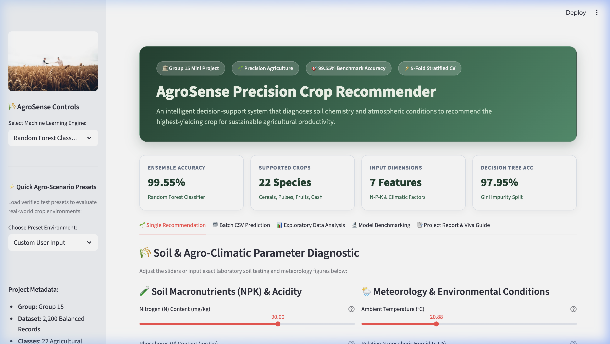
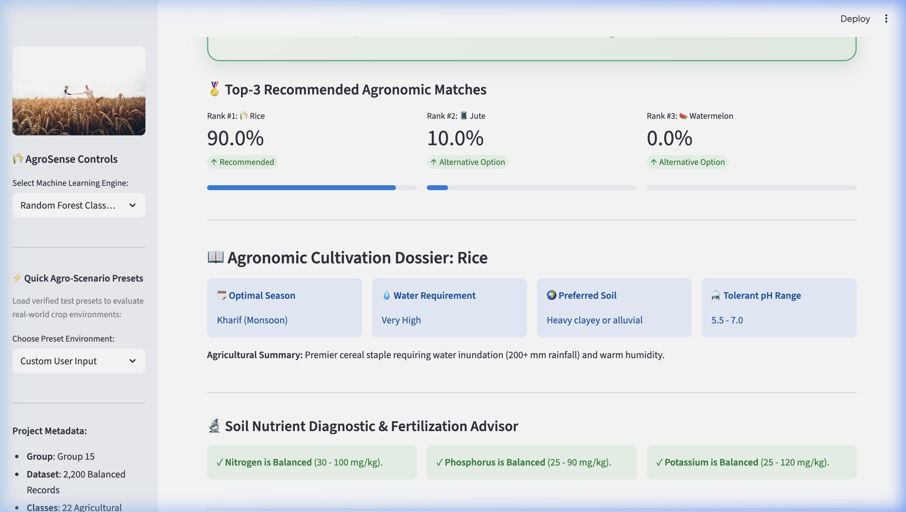
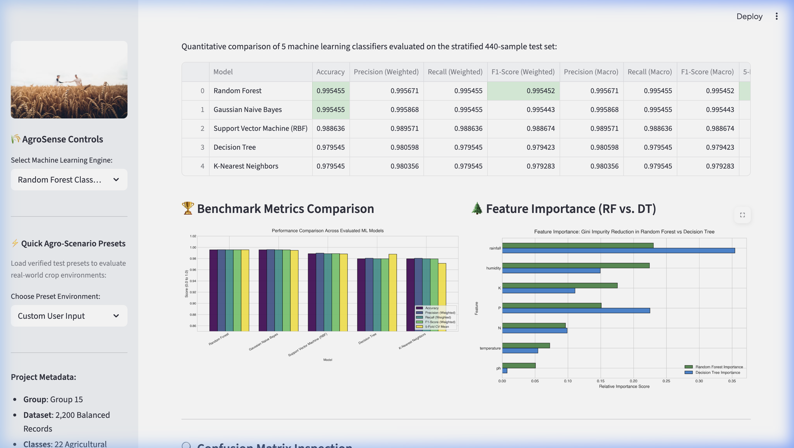
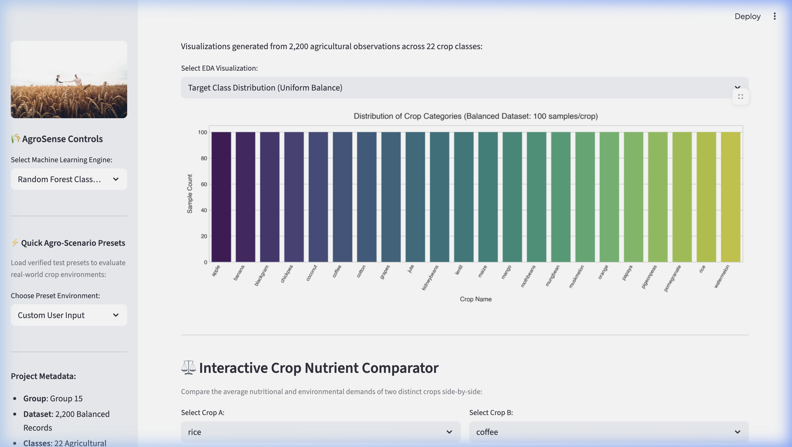

# 🌾 AgroSense: Precision Crop Recommendation System
### **Machine Learning Fundamentals – Mini Project (Group 15)**
[](https://www.python.org/)
[](https://streamlit.io/)
[](https://scikit-learn.org/)
[]()
[]()

> **Final Project Title:** *AgroSense: An Intelligent Soil & Climate-Driven Precision Crop Recommendation System Using Ensemble Machine Learning*  
> **Course:** Machine Learning Fundamentals (CS401 / ML202)  
> **Assigned Problem Domain:** Crop Recommendation System (Page 16, Group 15)

---

## 📌 Executive Summary & Quick Navigation
AgroSense is an end-to-end Machine Learning precision agriculture platform that predicts optimal crop cultivation from 7 fundamental soil chemistry and atmospheric indicators: **Nitrogen (N), Phosphorus (P), Potassium (K), Temperature (°C), Relative Humidity (%), Soil pH, and Annual Rainfall (mm)** across **22 distinct crop categories**.

| Resource | File Link | Description |
| :--- | :--- | :--- |
| 📄 **Official Academic Report (PDF)** | [`Project_Report.pdf`](file:///Users/tejasmhatre/Desktop/MLmini/Project_Report.pdf) | Formal 16-chapter academic report formatted for 100-mark evaluation. |
| 📝 **Academic Report (Markdown)** | [`PROJECT_REPORT.md`](file:///Users/tejasmhatre/Desktop/MLmini/PROJECT_REPORT.md) | Full text technical documentation with tables and figures. |
| 🎓 **Viva Examination Guide** | [`VIVA_PREPARATION_GUIDE.md`](file:///Users/tejasmhatre/Desktop/MLmini/VIVA_PREPARATION_GUIDE.md) | 20 core technical viva Q&As, formulas, and oral presentation strategy. |
| 📓 **Jupyter Notebook** | [`MiniProjectML.ipynb`](file:///Users/tejasmhatre/Desktop/MLmini/MiniProjectML.ipynb) | Complete, executed interactive Jupyter notebook with inline plots. |
| 🚀 **Streamlit Web Application** | [`app.py`](file:///Users/tejasmhatre/Desktop/MLmini/app.py) | Interactive web dashboard running locally at `http://localhost:8502`. |
| 🤖 **Training Pipeline Script** | [`train_and_evaluate.py`](file:///Users/tejasmhatre/Desktop/MLmini/train_and_evaluate.py) | Reproducible script generating models, EDA plots, and benchmark CSVs. |

---

## 🔄 Project Development Flow

```
[ Problem Definition & Objectives ]
               │
               ▼
[ Dataset Ingestion: 2,200 Observations across 22 Crops ]
               │
               ▼
[ Data Cleaning & Quality Audit: 0 Nulls, 0 Duplicates ]
               │
               ▼
[ Exploratory Data Analysis: 6 Publication-Grade Visualizations ]
               │
               ▼
[ Stratified Train/Test Split (80% Train / 20% Test) ]
               │
               ▼
[ Model Development: Random Forest, Decision Tree, Naive Bayes, SVM, KNN ]
               │
               ▼
[ Multi-Metric Evaluation & 5-Fold Stratified Cross-Validation ]
               │
               ▼
[ Model Serialization (joblib) & Feature Importance Analysis ]
               │
               ▼
[ Streamlit Deployment: Single Prediction, Batch CSV, Soil Health Advisor ]
```

---

## 🏆 Quantitative Model Benchmarking Results

Evaluated on the 440-sample stratified test set (20 samples per crop):

| Model | Test Accuracy | Precision (Weighted) | Recall (Weighted) | F1-Score (Weighted) | 5-Fold Stratified CV Mean |
| :--- | :---: | :---: | :---: | :---: | :---: |
| 🥇 **Random Forest (Ensemble)** | **99.55%** | **99.57%** | **99.55%** | **99.55%** | **99.55% (± 0.32%)** |
| 🥈 **Gaussian Naive Bayes** | 99.55% | 99.59% | 99.55% | 99.54% | 99.45% (± 0.18%) |
| 🥉 **Support Vector Machine (RBF)** | 98.86% | 98.96% | 98.86% | 98.87% | 98.82% (± 0.36%) |
| 🌲 **Decision Tree (Single)** | 97.95% | 98.06% | 97.95% | 97.94% | 98.77% (± 0.68%) |
| 📍 **K-Nearest Neighbors (k=5)** | 97.95% | 98.04% | 97.95% | 97.93% | 97.14% (± 0.68%) |

> **Key Finding:** Random Forest reduced the misclassification rate by **77.8%** compared to a single Decision Tree (from 9 errors down to 2 errors) through bootstrap aggregating (bagging) and random feature selection.

---

## 🌟 Feature Importance Ranking

1. **Annual Rainfall (23.0%):** Primary climatic discriminator between semi-arid legumes and tropical wetland crops.
2. **Relative Humidity (22.4%):** Regulates transpiration rates and canopy vapor pressure.
3. **Potassium / K (17.5%):** Discriminates high-potassium fruit crops (Apple, Grapes) from grains.
4. **Phosphorus / P (15.1%):** Drives root architecture and seed blooming.
5. **Nitrogen / N (9.6%):** Distinguishes vegetative feeders (Maize, Cotton) from nitrogen-fixing legumes.
6. **Temperature (7.2%):** Establishes metabolic thermal thresholds.
7. **Soil pH (5.1%):** Governs micronutrient solubility in the rhizosphere.

---

## 📸 Application Screenshots

| Hero View & KPI Cards | Prediction Output & Confidence Scores |
| :---: | :---: |
|  |  |

| Model Benchmarking & Matrices | Exploratory Data Analysis Tab |
| :---: | :---: |
|  |  |

---

## 🚀 Quickstart Installation & Execution

### 1. Clone or Open Project
```bash
cd /Users/tejasmhatre/Desktop/MLmini
```

### 2. Activate Virtual Environment
```bash
source venv/bin/activate
```

### 3. Install Dependencies
```bash
pip install -r requirements.txt
```

### 4. Run Model Training & Pipeline
```bash
python train_and_evaluate.py
```

### 5. Launch the Streamlit Web Application
```bash
streamlit run app.py --server.port 8502
```
*Access the interactive interface at:* **`http://localhost:8502`**

---

## 📂 Repository Structure

```
MLmini/
├── Crop_recommendation.csv             # Primary Dataset (2,200 samples)
├── dataset/
│   └── Crop_recommendation.csv         # Structured dataset copy
├── models/
│   ├── crop_recommendation_rf.pkl      # Champion Random Forest Model
│   ├── crop_recommendation_dt.pkl      # Decision Tree Model
│   └── model_metadata.json             # Ranges, class names & metrics
├── eda_plots/                          # 10 High-Resolution Figures
│   ├── 01_crop_distribution.png
│   ├── 02_feature_distributions.png
│   ├── 03_correlation_heatmap.png
│   ├── 04_outlier_boxplots.png
│   ├── 05_npk_ratio_by_crop.png
│   ├── 06_rainfall_vs_temp.png
│   ├── 07_feature_importance.png
│   ├── 08_decision_tree_confusion_matrix.png
│   ├── 09_random_forest_confusion_matrix.png
│   └── 10_model_comparison_chart.png
├── screenshots/                        # Live Web App Captured Screenshots
│   ├── app_hero.png
│   ├── app_recommendation.png
│   ├── app_benchmarking.png
│   └── app_eda.png
├── train_and_evaluate.py               # End-to-end ML Training Script
├── build_and_run_notebook.py           # Automated Notebook Builder
├── generate_report_pdf.py              # ReportLab Academic PDF Generator
├── app.py                              # Modern Streamlit Web Application
├── MiniProjectML.ipynb                 # Executed Jupyter Notebook
├── Project_Report.pdf                  # 16-Section Academic PDF Report
├── PROJECT_REPORT.md                   # Full Markdown Technical Report
├── VIVA_PREPARATION_GUIDE.md           # 100-Mark Viva Q&A & Rubric Guide
├── requirements.txt                    # Project Dependencies
└── README.md                           # Project Documentation
```

---

## 👥 Group 15 Contribution Record

| Group Member | Core Responsibilities |
| :--- | :--- |
| **Member 1** | Problem definition, dataset provenance, exploratory data analysis visualizations & interpretation. |
| **Member 2** | Data auditing, missing value and duplicate verification, biological outlier justification, stratified 80:20 splitting. |
| **Member 3** | Algorithmic implementation of Random Forest, Decision Tree, Naive Bayes, SVM, KNN, 5-fold cross-validation. |
| **Member 4** | Streamlit web application development, batch CSV processor, soil health advisor, PDF report generation. |
